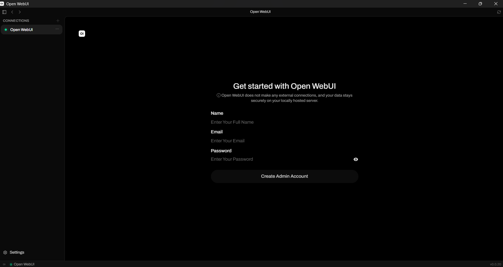
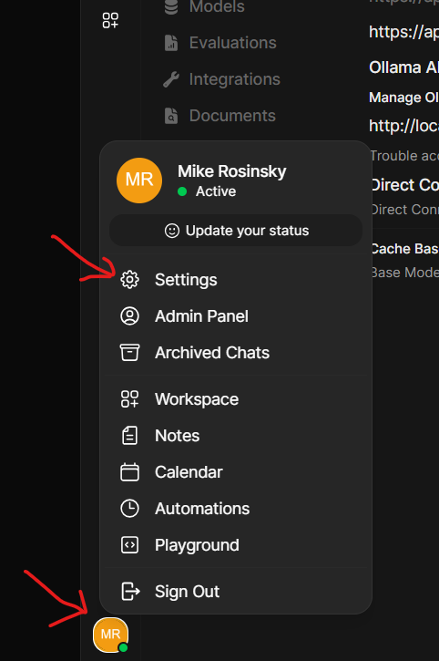
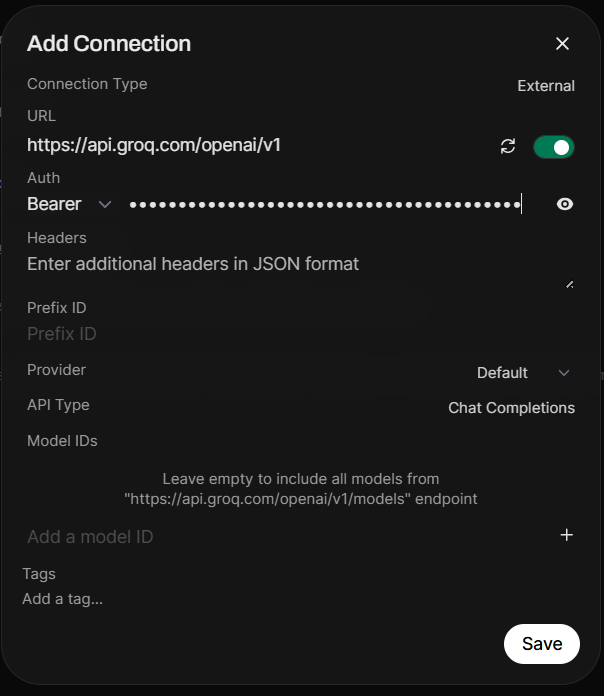
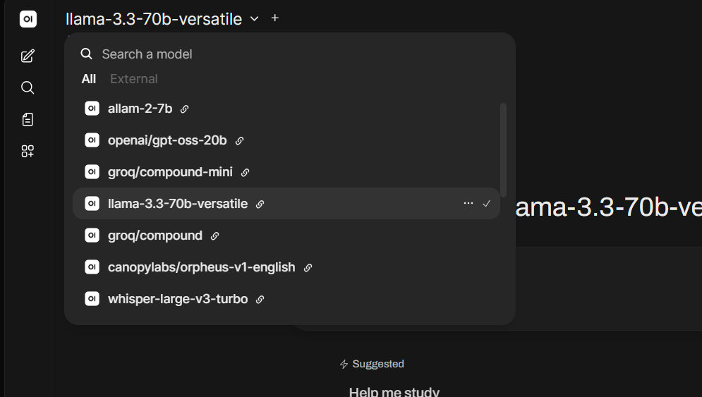
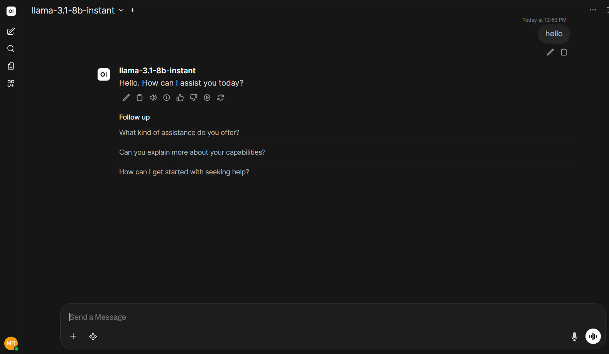

# Setup

## Clone this repo

```bash
git clone https://github.com/m-rosinsky/ai-familiarization.git
```

## Get a Groq API key

Open WebUI will use [Groq](https://groq.com/) to run cloud-hosted models. Groq offers a free tier and does not require a credit card.

1. Go to the [Groq Console](https://console.groq.com/) and sign up with email, Google, or GitHub.
2. Verify your email if prompted.
3. Open [**API Keys**](https://console.groq.com/keys) in the left sidebar.
4. Click **Create API Key**, give it a name (for example, `open-webui`), and click **Submit**.
5. Copy the key immediately. It starts with `gsk_` and is only shown once. If you lose it, create a new key.

Keep the key somewhere safe. You will paste it into Open WebUI in step 6 of [Launch and first-time setup](#launch-and-first-time-setup).

> Do not commit your API key to git or share it publicly.

> **Warning:** Groq's free tier provides enough tokens to get you through this class, but it has daily rate limits. Stick to the course outline—avoid extra experimentation or unrelated prompts, or you may hit your limit before the course is over.

## Download Open WebUI Desktop

Go to the [Open WebUI Desktop download page](https://github.com/open-webui/desktop#download) and install the build for your platform.

## Launch and first-time setup

1. Open **Open WebUI** from your applications menu or Start menu.
2. Select the option to **Run Locally**.
3. Select the **Open WebUI** connection on the left and create a local admin account:

|  |
|:--:|
| _Create a local admin account_ |

4. You should now see the chat input area:

|  |
|:--:|
| _Verify Open WebUI_ |

We now want to point Open WebUI to our Groq models.

5. Tap your profile icon, hit **Admin Panel**, **Settings**, **Connections**: 

|  |
|:--:|
| _Open settings_ |

6. Under **OpenAI API** → **Manage OpenAI API Connections**, click the **+** button.

   - Set URL to:

     ```text
     https://api.groq.com/openai/v1
     ```

   - Under **Auth**, select **Bearer**
   - Paste your Groq API key
   - Press **Save**

|  |
|:--:|
| _Configure Groq connection_ |

7. Press **New Chat**. You should now see a dropdown of models in the upper-left corner:

   - Select **`llama-3.1-8b-versatile`**

|  |
|:--:|
| _Validate models appear_ |

8. Send a test prompt and verify the model responds:

|  |
|:--:|
| _Test model response_ |
