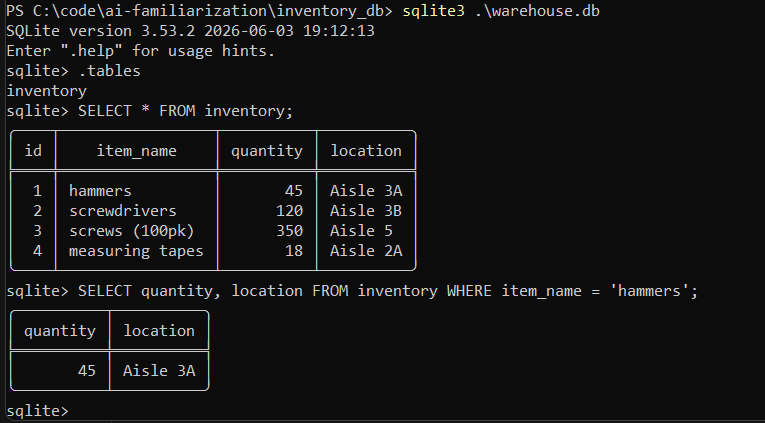
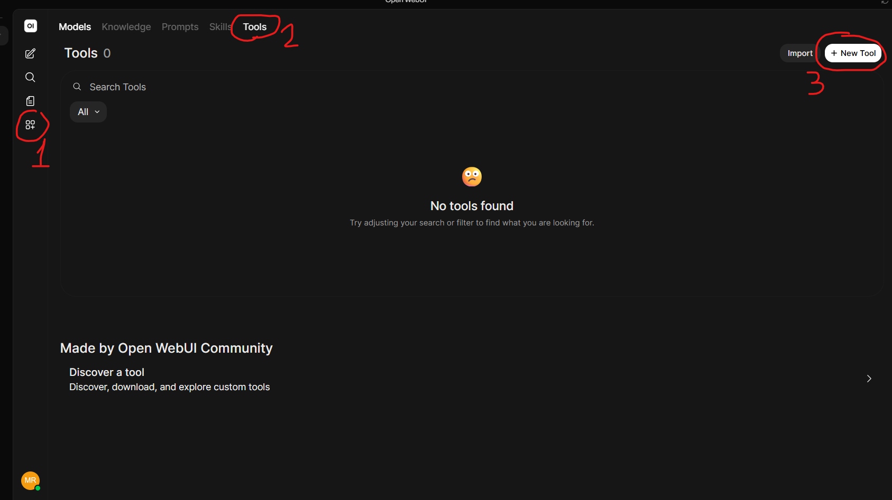
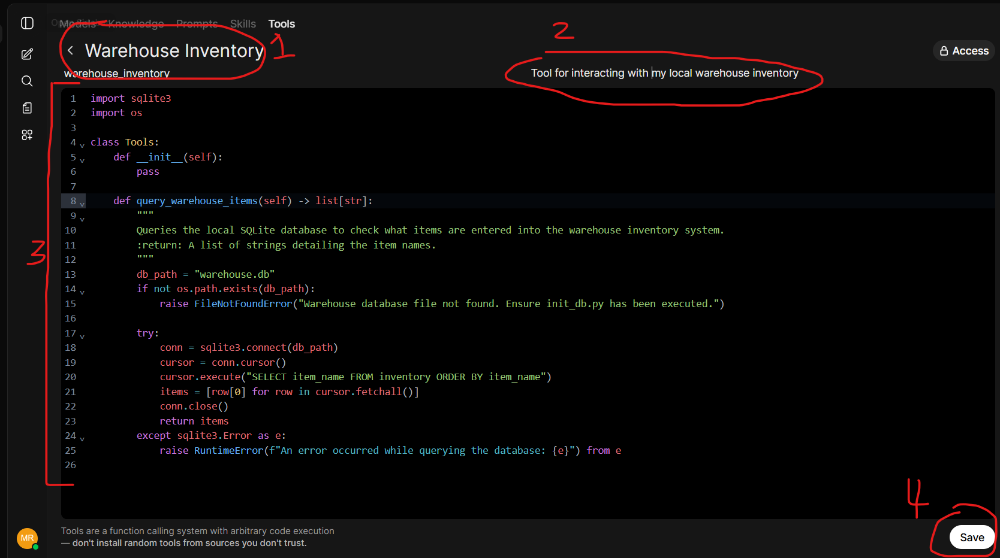
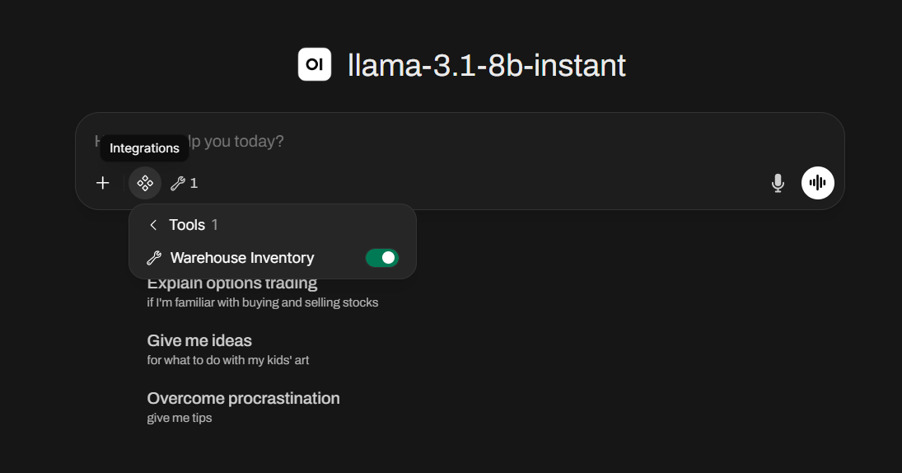
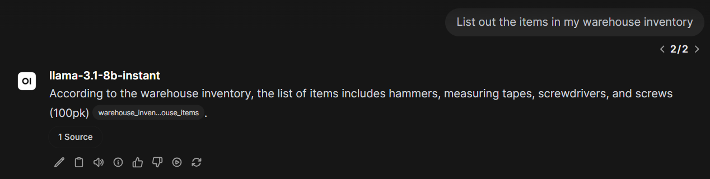

# Tools

Complete [01_Setup.md](01_Setup.md) before starting this file.

## Contents

- [1. What is an AI Tool?](#1-what-is-an-ai-tool)
- [2. Setting up our local database](#2-setting-up-our-local-database)
- [3. Query the database manually](#3-query-the-database-manually)
  - [3.1 Install the SQLite CLI](#31-install-the-sqlite-cli)
  - [3.2 Run queries with SQLite](#32-run-queries-with-sqlite)
  - [3.3 Create a Tool file](#33-create-a-tool-file)

## 1. What is an AI Tool?

> A specific executable function or API that an AI model can call to interact with the outside world, perform calculations, or fetch data (e.g., a web search tool, a calculator, or a file-writer). The model decides when to use it based on your prompt.

We want our AI to query and update a local warehouse inventory database—not just answer from memory.

To do this, we'll supply our AI with a Tool that tells it how and when to interact with the database. First, set up the database and verify it manually.

## 2. Setting up our local database

Set up a locally hosted database using Python and SQLite.

From the repo root, run:

```bash
cd inventory_db
python init_db.py
```

This creates `warehouse.db` in `inventory_db/` with an `inventory` table (item name, quantity, location) and seeds it with sample hardware-store stock.

You should see:

```text
Database initialized successfully with inventory data!
```

Re-running the script is safe, it won't duplicate existing rows.

## 3. Query the database manually

Before wiring the database up to the AI, connect locally and run a few queries yourself. This confirms the data is there and shows what the AI will be working with.

### 3.1 Install the SQLite CLI

Check whether `sqlite3` is already available:

```bash
sqlite3 --version
```

If that fails, install it for your platform:

**Windows:**

```bash
winget install SQLite.SQLite
```

**macOS:**

```bash
brew install sqlite
```

**Linux (Debian / Ubuntu):**

```bash
sudo apt update
sudo apt install sqlite3
```

### 3.2 Run queries with SQLite

From `inventory_db/`:

```bash
sqlite3 warehouse.db
```

At the `sqlite>` prompt:

```sql
.tables
SELECT * FROM inventory;
SELECT quantity, location FROM inventory WHERE item_name = 'hammers';
```

Exit with `.quit`.

|  |
|:--:|
| _Manual sqlite querying_ |

### 3.3 Create a Tool file

We want to enable our AI model to interface with our database so we can prompt it for information.

For this, we'll need to create a Tool.

In Open WebUI, Navigate to Workspace -> Tools -> New Tool:

|  |
|:--:|
| _Create new Tool_ |

This will open the Python file that Open WebUI references to make tool calls.

Take a second to look at some of the sample tools that Open WebUI comes preloaded with such as one to check the weather, and another to perform simple calculations.

We'll give the tool a name, a description, and replace the contents with the code found in `inventory_db/inventory_tool.py`:

|  |
|:--:|
| _Paste inventory_tool.py and click Save_ |

Then press **Save**.

#### Configure the database path

Open WebUI runs your tool from its own process—not from `inventory_db/`—so it cannot find `warehouse.db` with a relative path. After saving, open the tool's **Valves** settings and set **db_path** to the full path of your database file.

Example (use your actual repo location):

```text
C:/code/ai-familiarization/inventory_db/warehouse.db
```

We'll see our new tool now:

|  |
|:--:|
| _Our new tool_ |

Back in chat, enable our tool by clicking the "Integrations" icon and enabling our tool:

|  |
|:--:|
| _Enable our tool in chat_ |

Now we can prompt the AI about the items in our database:

|  |
|:--:|
| _AI tells us which items are in our inventory_ |

### 3.4 Practical Exercise

Expand the tool file to allow the AI to perform the following tasks:

- Update inventory to arbitrary amounts
- Add items to inventory
- Remove items from inventory
