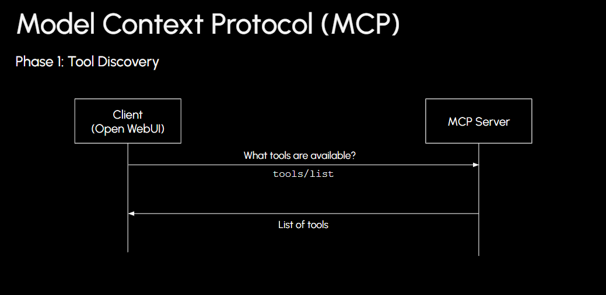
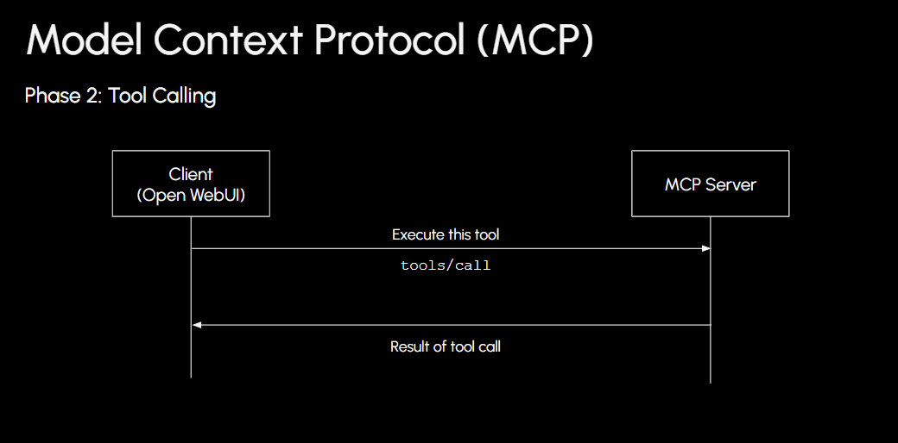
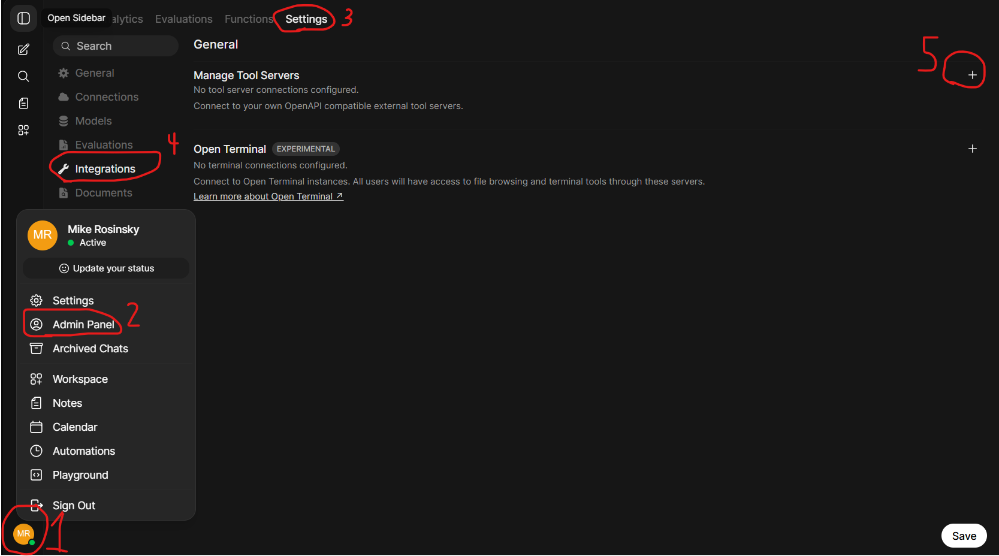
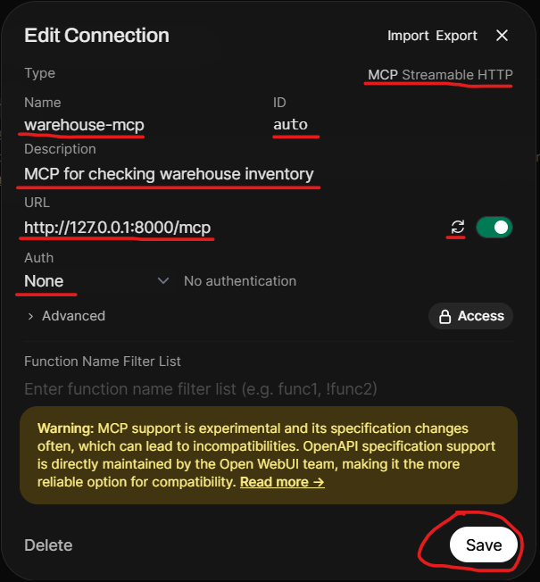
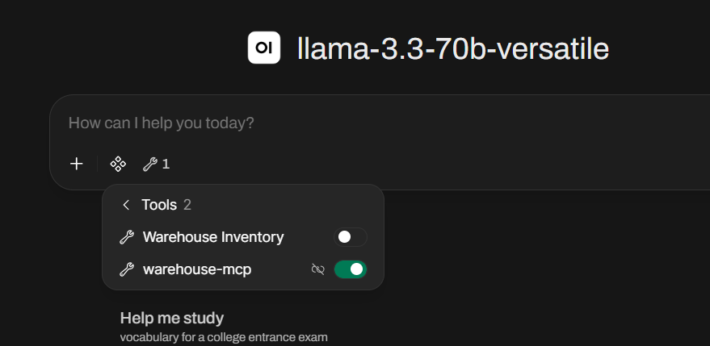
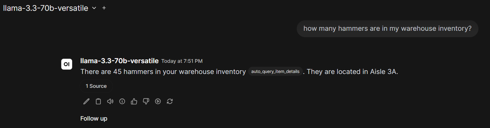

# MCP

Complete [02_Tools.md](02_Tools.md) before starting this file.

## Contents

- [1. What is MCP?](#1-what-is-mcp)
- [2. How does MCP work?](#2-how-does-mcp-work)
  - [2.1 Tool Discovery](#21-tool-discovery)
  - [2.2 Tool Calling](#22-tool-calling)
- [3. Writing an MCP Server](#3-writing-an-mcp-server)
  - [3.1 Install the MCP module](#31-install-the-mcp-module)
  - [3.2 Create the server file](#32-create-the-server-file)
  - [3.3 Start the server](#33-start-the-server)

## 1. What is MCP?

In [02_Tools.md](02_Tools.md), we gave our AI a **Tool**: a Python function it could call to query our warehouse database. That tool lives inside Open WebUI—name, description, code, and settings are all defined in that one app.

**MCP** solves the same problem at a higher level. Instead of writing a separate integration for every host, you run an MCP server that advertises its tools (and other capabilities) in a standard format. Any client that speaks MCP can connect, list what is available, and let the model invoke those tools—much like enabling our inventory tool under **Integrations**, but portable across apps.

> An open standard for connecting AI applications to external systems—databases, APIs, files, and other services—through a shared protocol. An MCP *server* exposes capabilities; an MCP *client* (such as Cursor or Open WebUI) lets the model discover and call them.

So: a Tool is what the model calls; MCP is how those tools (and related context) are packaged and delivered so they work beyond a single platform.

## 2. How does MCP work?

MCP works via a 2-step transaction between the client (in this case our Open WebUI app) and the MCP server

The two steps are:

1. Tool discovery
2. Tool calling

Data is exchanged using [JSON-RPC 2.0](https://www.jsonrpc.org/specification) data formatting.

### 2.1 Tool Discovery

In the tool discovery phase, the client simply asks the MCP server what tools it has available to call.

|  |
|:--:|
| _MCP Phase 1: Tool Discovery_ |

Here is a sample payload the client might send:

```json
{
    "jsonrpc": "2.0",
    "id": "init_1",
    "method": "tools/list"
}
```

and here is a sample payload an MCP server may reply with:

```json
{
    "jsonrpc": "2.0",
    "id": "init_1",
    "result": {
        "tools": [
            {
                "name": "query_warehouse_items",
                "description": "Queries the local SQLite database to check what items are entered into the warehouse inventory system.",
                "inputSchema": {
                    "type": "object",
                    "properties": {},
                    "required": [],
                    "additionalProperties": false
                }
            },
            {
                "name": "query_item_details",
                "description": "Look up an item's quantity and warehouse location by name.",
                "inputSchema": {
                    "type": "object",
                    "properties": {
                        "item_name": {
                            "type": "string",
                            "description": "The name of the inventory item to look up."
                        }
                    },
                    "required": ["item_name"]
                }
            }
        ]
    }
}
```

A Python function with no parameters—such as `query_warehouse_items()`—maps to an object schema with empty `properties` and an explicit `required` array. Omitting those fields can cause parsing issues in some clients.

The client receives this list and injects it into the **LLM's system context**—not into the chat transcript itself. It is the model that learns which tools exist and when to use them; the client application is the intermediary that fetches tool definitions from the MCP server and relays tool calls on the model's behalf.

### 2.2 Tool Calling

Once the model decides which tool to use, the client sends a `tools/call` request to the MCP server with the tool name and its arguments.

|  |
|:--:|
| _MCP Phase 2: Tool Calling_ |

Here is a sample payload the client might send to look up an item from our warehouse database:

```json
{
    "jsonrpc": "2.0",
    "id": "call_1",
    "method": "tools/call",
    "params": {
        "name": "query_item_details",
        "arguments": {
            "item_name": "hammers"
        }
    }
}
```

The MCP server runs the tool against `warehouse.db` and replies with the result:

```json
{
    "jsonrpc": "2.0",
    "id": "call_1",
    "result": {
        "content": [
            {
                "type": "text",
                "text": "Item: hammers | Quantity in stock: 45 | Location: Aisle 3A"
            }
        ],
        "isError": false
    }
}
```

The client passes that text back to the model, which can then answer the user's question in natural language.

## 3. Writing an MCP Server

Let's convert the tool we wrote in the previous section from Open WebUI-specific context to a standardized MCP server.

We'll use Python's `mcp` module to decorate our functions and run the server as a separate background process that Open WebUI connects to over HTTP.

### 3.1 Install the MCP module

From any directory, install the official MCP Python SDK:

```bash
python -m pip install mcp
```

### 3.2 Create the server file

In [02_Tools.md](02_Tools.md), our database logic lived inside Open WebUI's proprietary `Tools` class, with configuration handled through **Valves** in the UI. For MCP, we move that same logic into a standalone file: `inventory_db/inventory_mcp_server.py`.

The conversion follows three changes:

1. **Replace the `Tools` wrapper with `FastMCP`** — this registers our server name and handles the JSON-RPC protocol from Section 2.
2. **Mark each query function with `@mcp.tool()`** — FastMCP reads the function name, type hints, and docstring to build the `tools/list` schemas automatically.
3. **Configure the database path via environment variable** — instead of Valves, the server reads `WAREHOUSE_DB_PATH` or defaults to `warehouse.db` in the same folder.

Open `inventory_db/inventory_mcp_server.py`. The structure looks like this:

```python
from mcp.server.fastmcp import FastMCP

mcp = FastMCP("warehouse-inventory")

@mcp.tool()
def query_warehouse_items() -> list[str]:
    """Queries the local SQLite database to check what items are entered into the warehouse inventory system."""
    ...

@mcp.tool()
def query_item_details(item_name: str) -> str:
    """Look up an item's quantity and warehouse location by name."""
    ...

if __name__ == "__main__":
    mcp.run(transport="streamable-http")
```

The SQLite queries inside each function are the same as in `inventory_tool.py`. What changed is only the wrapper around them.

Make sure the database exists (from [02_Tools.md](02_Tools.md)):

```bash
cd inventory_db
python init_db.py
```

Then start the MCP server from the same folder:

```bash
python inventory_mcp_server.py
```

You should see output similar to:

```text
INFO:     Started server process [...]
INFO:     Waiting for application startup.
StreamableHTTP session manager started
INFO:     Application startup complete.
INFO:     Uvicorn running on http://127.0.0.1:8000 (Press CTRL+C to quit)
```

Leave this terminal open while you work—the server runs in the foreground and stops when you close it or press **Ctrl+C**.

The MCP endpoint is:

```text
http://127.0.0.1:8000/mcp
```

If you see an error that port 8000 is already in use, another process is bound to that port. Stop the other process or close any previous server instance, then try again.

Optionally, if `warehouse.db` lives somewhere other than `inventory_db/`, set the path before starting:

**Windows (PowerShell):**

```powershell
$env:WAREHOUSE_DB_PATH = "C:/code/ai-familiarization/inventory_db/warehouse.db"
python inventory_mcp_server.py
```

**macOS / Linux / Git Bash:**

```bash
export WAREHOUSE_DB_PATH="C:/code/ai-familiarization/inventory_db/warehouse.db"
python inventory_mcp_server.py
```

With the server running, we can connect Open WebUI to it as an external MCP tool.

### 3.3 Connect Open WebUI to our MCP

Now we can add our running MCP server address to Open WebUI to use:

1. Click the profile icon -> **Admin Panel** -> **Settings** -> **Integrations** and click the '+' button on **Manage Tool Servers**:

|  |
|:--:|
| _MCP settings in Open WebUI_ |

2. Select type -> MCP and fill our the rest of the fields, then click save:

|  |
|:--:|
| _Warehouse MCP configuration_ |

3. Switching back to chat mode, we should see the MCP server in the **Integrations** dropdown:

|  |
|:--:|
| _Successful MCP integration_ |

4. Now we can ask about our warehouse inventory just like before, but this time we're delegating the tool calls to our MCP server rather than our client running them directly:

|  |
|:--:|
| _MCP running in chat_ |
