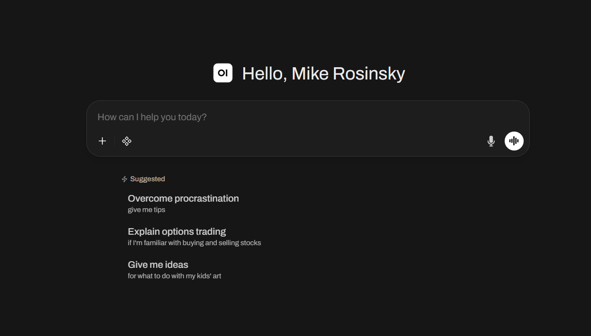

# Day 1: AI Concepts

## Contents

- [1. Purpose](#1-purpose)
- [2. Setup](#2-setup)
  - [2.1 Download Open WebUI Desktop](#21-download-open-webui-desktop)
  - [2.2 Launch and first-time setup](#22-launch-and-first-time-setup)

## 1. Purpose

Students will be familiarized with the following concepts of modern AI usage:

- Locally/hybrid hosted models
- Skills
- MCPs
- Loops

## 2. Setup

Install [Open WebUI Desktop](https://github.com/open-webui/desktop) — a native app for macOS, Windows, and Linux. No Python, pip, Docker, or terminal setup required.

### 2.1 Download Open WebUI Desktop

Go to the [Open WebUI Desktop download page](https://github.com/open-webui/desktop#download) and install the build for your platform:

### 2.2 Launch and first-time setup

1. Open **Open WebUI** from your applications menu or Start menu.
2. Select the option to <b>Run Locally</b>
3. Select the "Open WebUI" connection on the left and create a local Admin Account:

|  |
|:--:|
| _Create a local admin account_ |

3. a. You should now see a place to prompt:

|  |
|:--:|
| _Verify Open WebUI_ |

4. Open "Settings" by clicking your profile portrait -> Settings:

|  |
|:--:|
| _Open settings_ |

5. Under **OpenAI API** → **Manage OpenAI API Connections**, click the **+** button.

   - Set URL to:

     ```text
     https://api.groq.com/openai/v1
     ```

   - Under **Auth**, select **Bearer**
   - Paste your Groq API Key
   - Press **Save**

|  |
|:--:|
| _Configure Groq connection_ |

6. Press "New Chat". You should now get a dropdown of models in the top left:

|  |
|:--:|
| _Validate models appear_ |

    - Select `llama-3.1-8b-instant`

7. Verify a response with a test prompt:

|  |
|:--:|
| _Test model response_ |